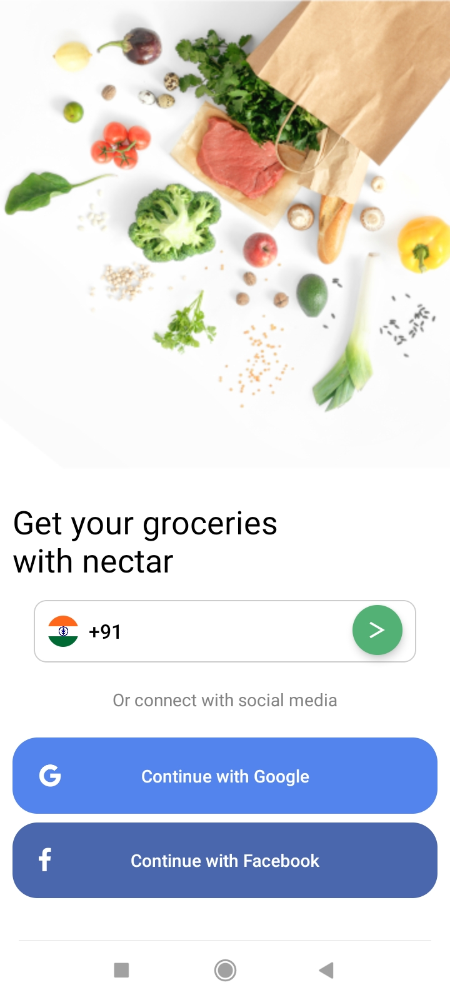
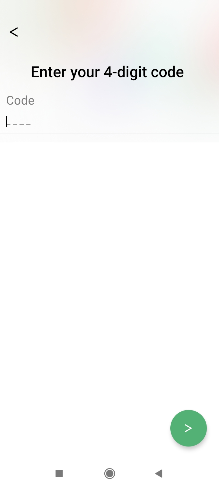
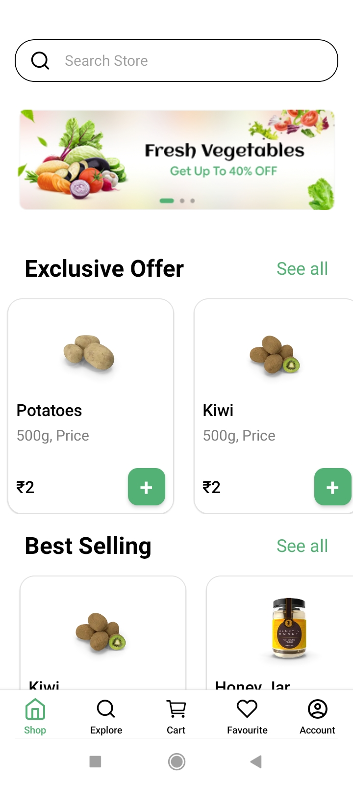
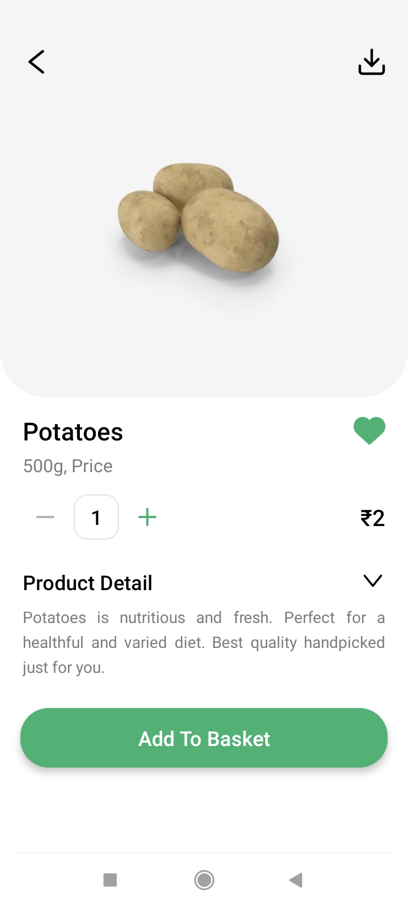
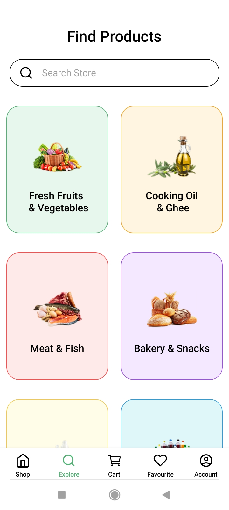
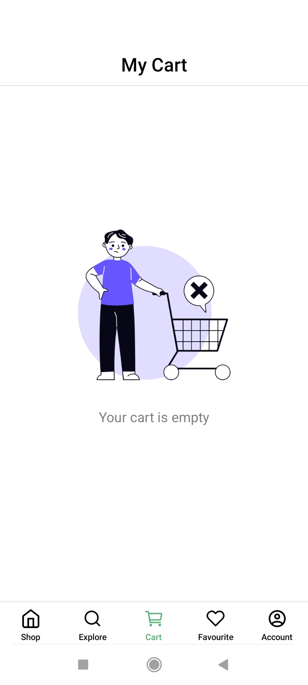
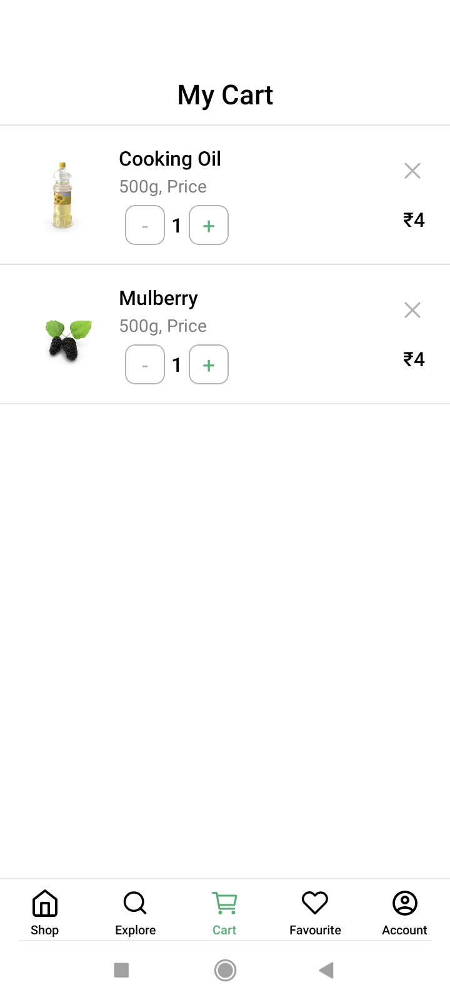
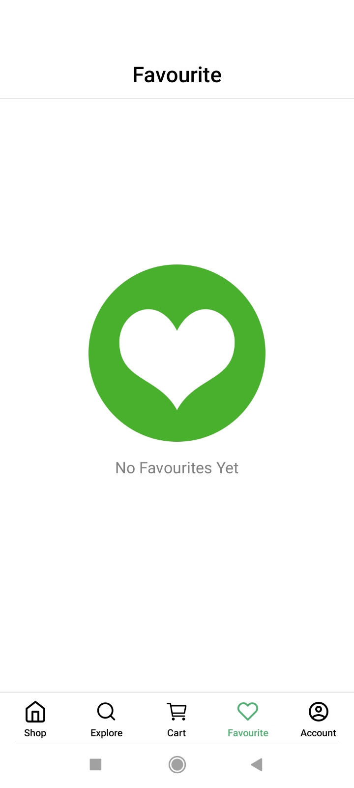
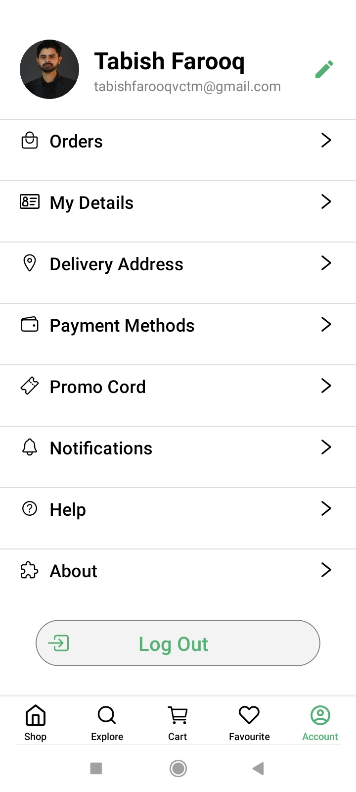

# Grocery App - React Native

A modern and responsive grocery shopping app built with <strong>React Native</strong>, Redux Toolkit, and dummy API data. This app allows users to explore groceries, add items to the cart, mark favourites, and view detailed product information.

## Table of Contents

<ul>
  <li><a href="#features">Features</a></li>
  <li><a href="#app-flow">App Flow</a></li>
  <li><a href="#screenshots">Screenshots</a></li>
  <li><a href="#technologies-used">Technologies Used</a></li>
  <li><a href="#installation">Installation</a></li>
  <li><a href="#usage">Usage</a></li>
  <li><a href="#folder-structure">Folder Structure</a></li>
  <li><a href="#redux-state-management">Redux State Management</a></li>
  <li><a href="#api-integration">API Integration</a></li>
  <li><a href="#troubleshooting">Troubleshooting</a></li>
  <li><a href="#contributing">Contributing</a></li>
  <li><a href="#license">License</a></li>
</ul>

## Features

<ul>
  <li>Browse exclusive, best-selling, and grocery products</li>
  <li>Search bar functionality for quick product search</li>
  <li>Add items to the cart with dynamic quantity selection</li>
  <li>Favourite products with heart toggle</li>
  <li>Product details screen with description and price</li>
  <li>Bottom Tab Navigation for easy access to Shop, Explore, Cart, Favourite, and Account screens</li>
  <li>Responsive UI compatible with different screen sizes</li>
</ul>

## App Flow

The app follows this flow from start to finish:

  <strong>HomeScreen → LoginScreen → OTPScreen → APIFetchScreen → MainScreen → ProductDetailScreen → ExploreScreen → EmptyCartScreen → CartScreen → EmptyFavouriteScreen → FavouriteScreen → ProfileScreen</strong>

## Screenshots

<table cellspacing="20">
  <tr>
    <th align="center"><h1>Home Screen</h1></th>
    <th align="center"><h1>Login Screen</h1></th>
    <th align="center"><h1>OTP Screen</h1></th>
  </tr>
  <tr>
    <td align="center" style="border:4px solid black; padding:15px;">
      
    </td>
    <td align="center" style="border:4px solid black; padding:15px;">
      
    </td>
    <td align="center" style="border:4px solid black; padding:15px;">
      
    </td>
  </tr>
</table>

 

<table cellspacing="20">
  <tr>
    <th align="center"><h1>API Fetch</h1></th>
    <th align="center"><h1>Main Screen</h1></th>
    <th align="center"><h1>Product Detail</h1></th>
  </tr>
  <tr>
    <td align="center" style="border:4px solid black; padding:15px;">
      
    </td>
    <td align="center" style="border:4px solid black; padding:15px;">
      
    </td>
    <td align="center" style="border:4px solid black; padding:15px;">
      
    </td>
  </tr>
</table>

 

<table cellspacing="20">
  <tr>
    <th align="center"><h1>Explore Screen</h1></th>
    <th align="center"><h1>Empty Cart Screen</h1></th>
    <th align="center"><h1>Cart Screen</h1></th>
  </tr>
  <tr>
    <td align="center" style="border:4px solid black; padding:15px;">
      
    </td>
    <td align="center" style="border:4px solid black; padding:15px;">
      
    </td>
    <td align="center" style="border:4px solid black; padding:15px;">
      
    </td>
  </tr>
</table>

 

<table cellspacing="20">
  <tr>
    <th align="center"><h1>Empty Favourite</h1></th>
    <th align="center"><h1>Favourite Screen</h1></th>
    <th align="center"><h1>Profile Screen</h1></th>
  </tr>
  <tr>
    <td align="center" style="border:4px solid black; padding:15px;">
      
    </td>
    <td align="center" style="border:4px solid black; padding:15px;">
      
    </td>
    <td align="center" style="border:4px solid black; padding:15px;">
      
    </td>
  </tr>
</table>

## Technologies Used

<ul>
  <li><strong>React Native</strong> – Framework for building cross-platform mobile apps</li>
  <li><strong>Redux Toolkit</strong> – Efficient state management solution</li>
  <li><strong>React Navigation</strong> – Stack & Bottom Tab navigation</li>
  <li><strong>DummyJSON API</strong> – Fetch grocery product data</li>
  <li><strong>React Native Vector Icons</strong> – For icons in the app</li>
</ul>

## Installation

<strong>Note:</strong> Make sure you have completed the <a href="https://reactnative.dev/docs/environment-setup">Set Up Your Environment</a> guide before proceeding.

<ol>
  <li>Clone the repository:
    <pre><code>git clone https://github.com/Tabish-Farooq/GroceriesApp.git</code></pre>
  </li>
  <li>Navigate to project folder:
    <pre><code>cd GroceriesApp</code></pre>
  </li>
  <li>Install dependencies:
    <pre><code>npm install
# or
yarn install</code></pre>
  </li>
  <li>Start Metro bundler:
    <pre><code>npm start
# or
yarn start</code></pre>
  </li>
  <li>Run on Android:
    <pre><code>npm run android
# or
yarn android</code></pre>
  </li>
  <li>Run on iOS (Mac only):
    <pre><code>bundle install
bundle exec pod install
npm run ios
# or
yarn ios</code></pre>
  </li>
</ol>

💡 Tip: Use <code>npx react-native doctor</code> to check your environment setup

