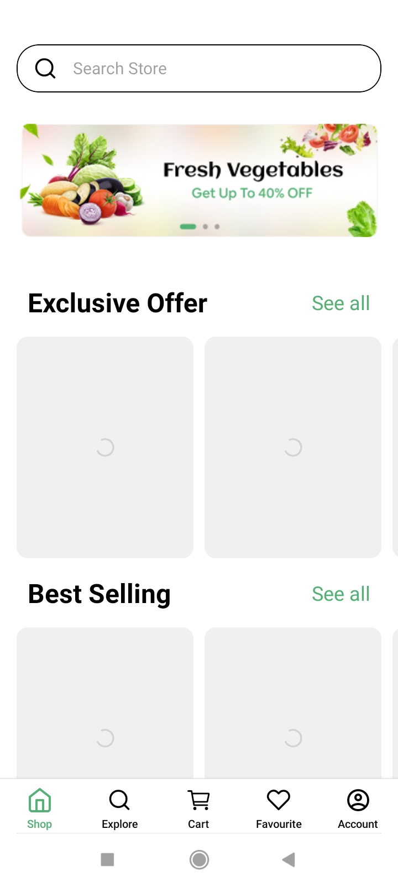

# Grocery App - React Native

A modern and responsive grocery shopping app built with **React Native**, Redux Toolkit, and dummy API data. This app allows users to explore groceries, add items to the cart, mark favourites, and view detailed product information.

---

## Table of Contents

- [Features](#features)
- [App Flow](#app-flow)
- [Screenshots](#screenshots)
- [Technologies Used](#technologies-used)
- [Installation](#installation)
- [Usage](#usage)
- [Folder Structure](#folder-structure)
- [Redux State Management](#redux-state-management)
- [API Integration](#api-integration)
- [Troubleshooting](#troubleshooting)
- [Future Enhancements](#future-enhancements)
- [Contributing](#contributing)
- [License](#license)

---

## Features

- Browse exclusive, best-selling, and grocery products
- Search bar functionality for quick product search
- Add items to the cart with dynamic quantity selection
- Favourite products with heart toggle
- Product details screen with description and price
- Bottom Tab Navigation for easy access to Shop, Explore, Cart, Favourite, and Account screens
- Responsive UI compatible with different screen sizes

---

## App Flow

**HomeScreen → LoginScreen → OTPScreen → APIFetchScreen → MainScreen → ProductDetailScreen → ExploreScreen → EmptyCartScreen → CartScreen → EmptyFavouriteScreen → FavouriteScreen → ProfileScreen**

---

## Screenshots

### Home, Login, and OTP Screens


### API Fetch, Main, and Product Detail Screens



### Explore, Empty Cart, and Cart Screens


### Empty Favourite, Favourite, and Profile Screens


---

## Technologies Used

- **React Native** – Framework for building cross-platform mobile apps
- **Redux Toolkit** – Efficient state management solution
- **React Navigation** – Stack & Bottom Tab navigation
- **DummyJSON API** – Fetch grocery product data
- **React Native Vector Icons** – For icons in the app

---

## Installation

**Note:** Ensure you have completed the [React Native Environment Setup](https://reactnative.dev/docs/environment-setup) before proceeding.

```bash
# Clone the repository
git clone https://github.com/Tabish-Farooq/GroceriesApp.git

# Navigate into the project directory
cd GroceriesApp

# Install dependencies
npm install
# or
yarn install

# Start Metro server
npx react-native start

# Run on Android
npx react-native run-android

# Run on iOS (Mac only)
npx react-native run-ios

<h2>Usage</h2>
<ul>
  <li>Launch the app on your emulator or physical device.</li>
  <li>Navigate through the bottom tabs: <strong>Shop, Explore, Cart, Favourite, and Account</strong>.</li>
  <li>Tap on any product to view details and add it to the cart or mark it as favourite.</li>
  <li>Use the search bar in the <strong>Explore</strong> screen to quickly find products.</li>
  <li>Update quantities in the cart and see real-time changes using Redux state management.</li>
</ul>

<h2>Folder Structure</h2>
<pre><code>GroceriesApp/
├── android/                 
├── ios/                     
├── src/
│   ├── assets/              
│   ├── components/          
│   ├── navigation/          
│   ├── screens/             
│   ├── redux/               
│   ├── api/                 
│   └── utils/               
├── App.js                   
├── package.json
└── README.md
</code></pre>

<h2>Redux State Management</h2>
<p>The app uses <strong>Redux Toolkit</strong> for efficient and scalable state management:</p>
<ul>
  <li><strong>Store</strong> – Centralized state container</li>
  <li><strong>Slices</strong> – Modular pieces of state (e.g., cartSlice, favouriteSlice)</li>
  <li><strong>Actions</strong> – Functions to update state (e.g., addItem, removeItem)</li>
  <li><strong>Selectors</strong> – Access parts of the state in components</li>
</ul>

<p><strong>Example usage:</strong></p>
<pre><code>import { useSelector, useDispatch } from 'react-redux';
import { addItem } from '../redux/cartSlice';

const CartButton = ({ product }) => {
  const dispatch = useDispatch();
  return (
    &lt;button onClick={() => dispatch(addItem(product))&gt;
      Add to Cart
    &lt;/button&gt;
  );
};
</code></pre>

<h2>API Integration</h2>
<p><strong>Base URL:</strong> https://dummyjson.com/products</p>
<p>Fetch data using <code>axios</code> or <code>fetch</code> inside <code>src/api/products.js</code></p>

<pre><code>import axios from 'axios';

export const getProducts = async () =&gt; {
  try {
    const response = await axios.get('https://dummyjson.com/products');
    return response.data.products;
  } catch (error) {
    console.error(error);
  }
};
</code></pre>

<h2>Troubleshooting</h2>
<ul>
  <li><strong>App not starting:</strong> Ensure Metro server is running and device/emulator is connected.</li>
  <li><strong>Dependencies issues:</strong> Delete <code>node_modules</code> and run <code>npm install</code> or <code>yarn install</code>.</li>
  <li><strong>Redux state not updating:</strong> Ensure the app is wrapped with <code>&lt;Provider store={store}&gt;</code>.</li>
</ul>

<h2>Future Enhancements</h2>
<ul>
  <li>Integration with real backend API</li>
  <li>User authentication and profile management</li>
  <li>Payment gateway integration for checkout</li>
  <li>Dark mode support</li>
  <li>Push notifications for offers and updates</li>
</ul>

<h2>Contributing</h2>
<ul>
  <li>Fork the repository</li>
  <li>Create a new branch: <code>git checkout -b feature-name</code></li>
  <li>Commit changes: <code>git commit -m "Add feature"</code></li>
  <li>Push to branch: <code>git push origin feature-name</code></li>
  <li>Create a Pull Request</li>
</ul>

<h2>License</h2>
<p>This project is licensed under the <strong>MIT License</strong> – see the <a href="LICENSE">LICENSE</a> file for details.</p>
