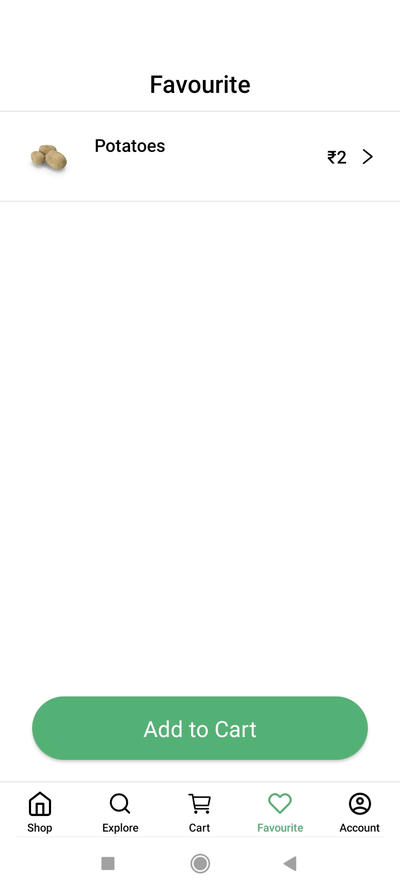

# Grocery App - React Native

A modern and responsive grocery shopping app built with **React Native**, Redux Toolkit, and dummy API data. This app allows users to explore groceries, add items to the cart, mark favourites, and view detailed product information.

---

## Table of Contents

- [Features](#features)
- [App Flow](#app-flow)
- [Screenshots](#screenshots)
- [Technologies Used](#technologies-used)
- [Installation](#installation)
- [Usage](#usage)
- [Folder Structure](#folder-structure)
- [Redux State Management](#redux-state-management)
- [API Integration](#api-integration)
- [Troubleshooting](#troubleshooting)
- [Contributing](#contributing)
- [License](#license)

---

## Features

- Browse exclusive, best-selling, and grocery products
- Search bar functionality for quick product search
- Add items to the cart with dynamic quantity selection
- Favourite products with heart toggle
- Product details screen with description and price
- Bottom Tab Navigation for easy access to Shop, Explore, Cart, Favourite, and Account screens
- Responsive UI compatible with different screen sizes

---

## App Flow

The app follows this flow from start to finish:

<div style="text-align:center;">
**HomeScreen → LoginScreen → OTPScreen → APIFetchScreen → MainScreen → ProductDetailScreen → ExploreScreen → EmptyCartScreen → CartScreen → EmptyFavouriteScreen → FavouriteScreen → ProfileScreen**
</div>

---

## Screenshots

<div align="center">

  <!-- Row 1 -->
  <table>
    <tr>
      <td align="center">
        <h2 style="text-decoration:none;">Home Screen</h2>
        
      </td>
      <td align="center">
        <h2 style="text-decoration:none;">Login Screen</h2>
        
      </td>
      <td align="center">
        <h2 style="text-decoration:none;">OTP Screen</h2>
        
      </td>
    </tr>
  </table>

  <br/>

  <!-- Row 2 -->
  <table>
    <tr>
      <td align="center">
        <h2 style="text-decoration:none;">API Fetch</h2>
        
      </td>
      <td align="center">
        <h2 style="text-decoration:none;">Main Screen</h2>
        
      </td>
      <td align="center">
        <h2 style="text-decoration:none;">Product Detail</h2>
        
      </td>
    </tr>
  </table>

  <br/>

  <!-- Row 3 -->
  <table>
    <tr>
      <td align="center">
        <h2 style="text-decoration:none;">Explore Screen</h2>
        
      </td>
      <td align="center">
        <h2 style="text-decoration:none;">Empty Cart</h2>
        
      </td>
      <td align="center">
        <h2 style="text-decoration:none;">Cart Screen</h2>
        
      </td>
    </tr>
  </table>

  <br/>

  <!-- Row 4 -->
  <table>
    <tr>
      <td align="center">
        <h2 style="text-decoration:none;">Empty Favourite</h2>
        
      </td>
      <td align="center">
        <h2 style="text-decoration:none;">Favourite Screen</h2>
        
      </td>
      <td align="center">
        <h2 style="text-decoration:none;">Profile Screen</h2>
        
      </td>
    </tr>
  </table>

</div>

---

## Technologies Used

- **React Native** – Framework for building cross-platform mobile apps
- **Redux Toolkit** – Efficient state management solution
- **React Navigation** – Stack & Bottom Tab navigation
- **DummyJSON API** – Fetch grocery product data
- **React Native Vector Icons** – For icons in the app

---

## Installation

**Note:** Make sure you have completed the [Set Up Your Environment](https://reactnative.dev/docs/environment-setup) guide before proceeding.

1. Clone the repository:
   ```bash
   git clone https://github.com/Tabish-Farooq/GroceriesApp.git
<h2>Navigate into the project directory:</h2>
<pre><code>cd GroceriesApp</code></pre>

<h2>Install dependencies:</h2>
<pre><code>npm install
# or
yarn install
</code></pre>

<h2>Start the Metro server:</h2>
<pre><code>npx react-native start</code></pre>

<h2>Run the app on Android:</h2>
<pre><code>npx react-native run-android</code></pre>

<h2>Run the app on iOS (Mac only):</h2>
<pre><code>npx react-native run-ios</code></pre>

<h2>Usage</h2>
<ul>
  <li>Launch the app on your emulator or physical device.</li>
  <li>Navigate through the bottom tabs: <strong>Shop, Explore, Cart, Favourite, and Account</strong>.</li>
  <li>Tap on any product to view details and add it to the cart or mark it as favourite.</li>
  <li>Use the search bar in the <strong>Explore</strong> screen to quickly find products.</li>
  <li>Update quantities in the cart and see real-time changes using Redux state management.</li>
</ul>

<h2>Folder Structure</h2>
<pre><code>GroceriesApp/
│
├── android/                 # Android native files
├── ios/                     # iOS native files
├── src/
│   ├── assets/              # Images, fonts, icons
│   ├── components/          # Reusable components
│   ├── navigation/          # Navigation stack & tabs
│   ├── screens/             # All app screens
│   ├── redux/               # Redux slices & store
│   ├── api/                 # API calls & services
│   └── utils/               # Helper functions
├── App.js                   # Main app entry
├── package.json
└── README.md
</code></pre>
